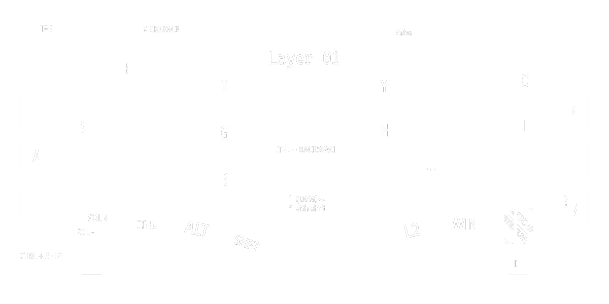
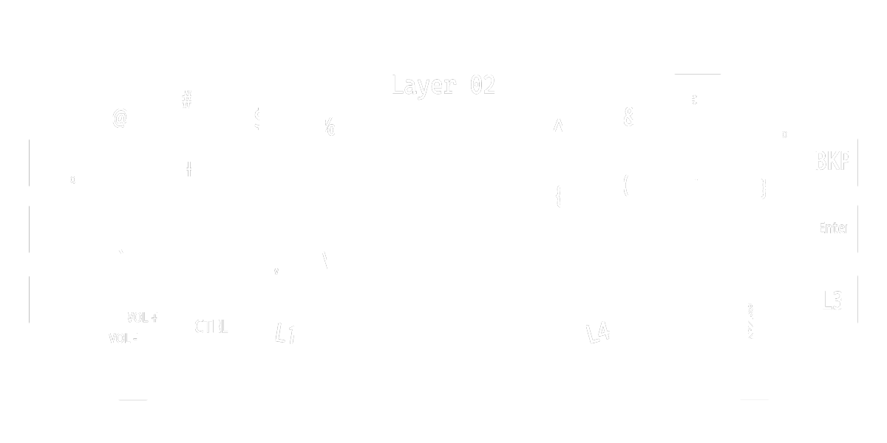
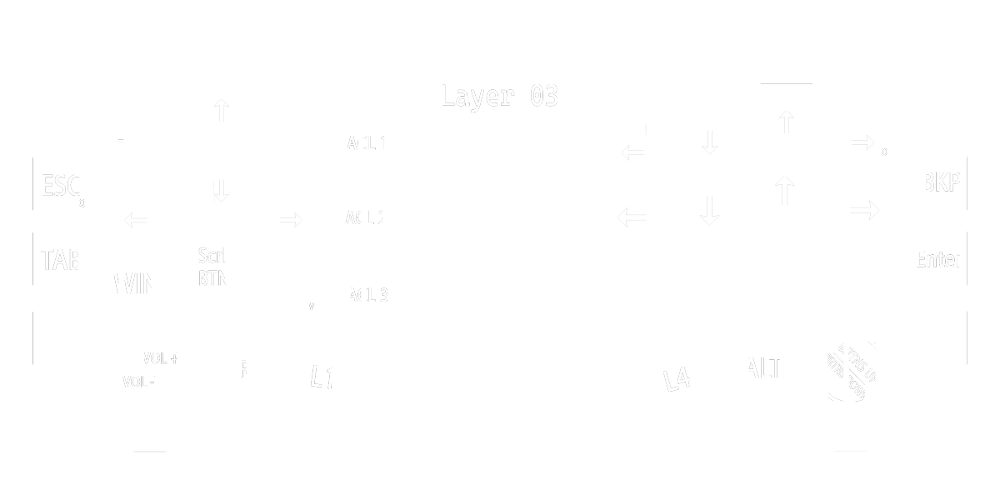
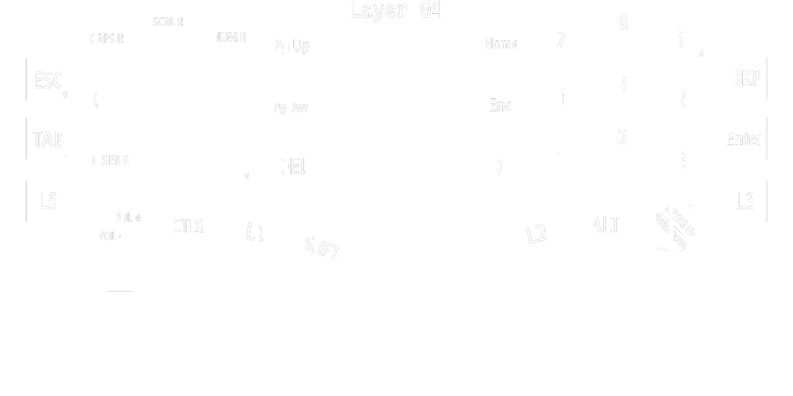
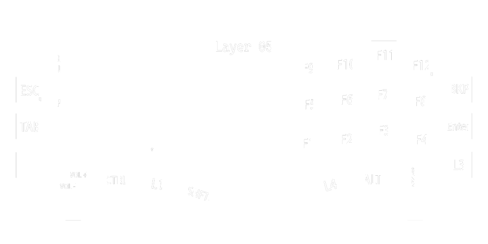
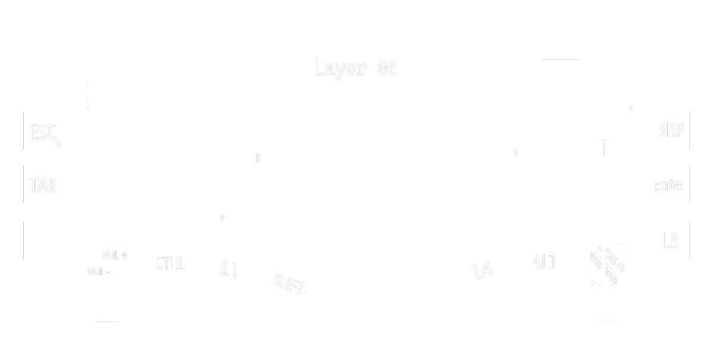

# 34-QWERTY-Tap-Switch-Keymap
My 34-key QWERTY split keymap with tap-only layer switching, no home-row holds, and combos for essential keys.

## The Idea behind the keymap.

I recently started building a 34 key split keyboard mainly for it's portability. And almost all the keymaps that I came across while searching for a suitable keymap had some issues for me that I didn't want to use them. Some of them were:

1. Key holds for layers and modifiers which I am not familiar with 
2. Most of the keymaps were optimized for a single text editor or task.

I am already good with a standard QWERTY keyboard that I built myself some years back and I want to keep the roots of a standard QWERTY keyboard for me to switch back and forth my own keebs. Additionally, since almost all the keyboard that I will come across in different environments are bound to be standard QWERTY keyboards, I wanna keep the basic movements of the keeb similar to a standard board.

## My Approach

This keymap consists of 6 layers in total with a key-tap based layer switches. For the first(default) layer I chose to go with the exact keys of a standard keyboard. Following that, There is a symbols layer in the second position, a navigation layer in the third position, numbers layer on the forth, functions and other controls on the fifth and the final layer is dedicated to all the settings and configs of the keeb itself. 

In the first layer, there is access to some much-needed keys as it will be troublesome to switch layers to just find an Enter or a Backspace and so.

A full writeup for the keymap will be soon posted in my blog.

## The Keymap

## Layer 01

## Layer 02

## Layer 03

## Layer 04

## Layer 05

## Layer 06
